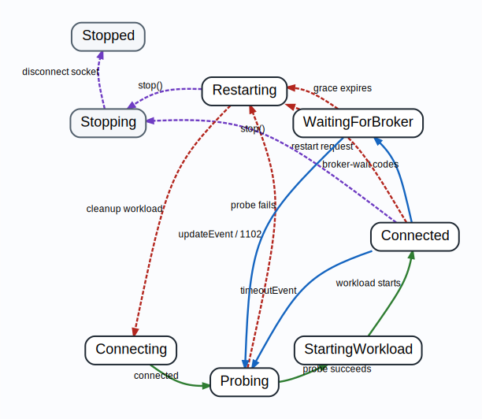

*********************
Connection Supervisor
*********************

``haymaker.supervisor.ConnectionSupervisor`` runs one workload under one
Haymaker-owned Interactive Brokers API socket. It is used by live execution and
by the dataloader's supervised connection path. It reconnects the IB API client and
rebuilds the supervised workload when recovery requires a rebuild, but it does
not start, stop, or restart TWS or IB Gateway.

Use a supervisor only when Haymaker owns the socket lifecycle. The current
dataloader model is supervised-only: the dataloader creates its own ``IB``
client and uses a client ID distinct from the live runtime. Any future
Watchdog/IBC gateway-management runner should be a separate dataloader runner,
not a feature inside ``ConnectionSupervisor``.

Using the Supervisor
====================

The supervisor needs three things:

* an ``ib_insync.IB`` instance whose socket Haymaker is allowed to own;
* a workload object with async ``start()`` and ``stop(reason)`` methods;
* optional :class:`haymaker.supervisor.ConnectionSettings`.

The main entrypoint is ``run()``. It connects, probes the broker, starts the
workload, handles reconnect/rebuild cycles, and returns only after shutdown.

.. code-block:: python

   from haymaker.supervisor import ConnectionSettings, ConnectionSupervisor

   supervisor = ConnectionSupervisor(
       ib,
       workload,
       ConnectionSettings.from_config(config, client_id=client_id),
   )

   await supervisor.run()

The public lifecycle API is intentionally small:

* ``run()`` owns connection setup, workload execution, restarts, and cleanup.
* ``stop()`` records a shutdown request. The running supervisor loop performs
  cleanup.
* ``request_restart(reason)`` records a restart request. The active supervisor
  race decides whether and when to rebuild the owned socket and workload.

Workload Contract
=================

The workload is started only after a successful connection probe. For live
execution this workload is ``LiveRuntime``; for managed dataloader runs it is
``DataloaderRuntime``.

``start()`` should run until the workload completes or is cancelled. If it
returns normally, the supervisor treats the workload as complete and stops.

``stop(reason)`` should release active work before restart or shutdown. The
supervisor cancels the workload task after calling ``stop(reason)``.

How Recovery Works
==================

The supervisor is a small state machine. States perform connection-specific
work and return a proposed next state. The supervisor owns lifecycle priority:
``stop()`` wins over restart, and restart requests are ignored while restart or
shutdown cleanup is already active.

The run loop evaluates each state through a supervisor race. The race waits for
the state's ``handle()`` task together with the lifecycle request events and
workload task that are meaningful for the active state. This is needed because
service interruptions are independent of normal state progress: broker messages,
unexpected socket disconnects, explicit shutdown, and workload completion can
arrive while a state is blocked in broker I/O, a retry sleep, or a state-local
wait. The first completed task wakes the supervisor, then the race applies the
central priority rules and returns the next state.

Broker messages are grouped into three categories:

* restart requests, such as ``1101`` and ``1300``;
* broker-wait signals, such as ``1100``, ``2110``, ``2103``, ``2105``,
  ``2157``, and ``10182``;
* recovery hints, such as ``1102`` when
  ``restart_on_recovered_connection`` is false.

``timeoutEvent`` remains an active health check while connected. It triggers a
probe rather than an immediate reconnect. While waiting for broker-side
auto-recovery, ``updateEvent`` or ``1102`` can trigger a probe because traffic
has resumed. A successful probe proves current request connectivity, but it does
not prove existing subscriptions are fresh; streamer timeouts should still
detect stale subscriptions later.

State Transition Chart
======================

The chart shows the regular lifecycle flow as solid green arrows, with
alternative recovery and shutdown paths shown as dashed blue, red, and purple
arrows. Arrow labels name the condition that causes each transition. The purple
stop paths are representative rather than exhaustive; ``stop()`` can interrupt
active states except restart cleanup, where it is applied after cleanup
finishes. The broker-code lists are kept in the prose around the chart so the
picture stays readable.

Priority Rules
==============

``stop()`` has the highest priority. If a stop request arrives while restart
cleanup is running, the supervisor finishes that cleanup without cancelling it
and goes to ``Stopping`` instead of reconnecting.

Restart requests coalesce. Multiple restart requests before the rebuild cycle
are handled as one restart, and restart requests are ignored once
``Restarting``, ``Stopping``, or ``Stopped`` is active.

Broker wait is not a hidden connected sub-state. Broker-degraded messages move
the state machine to ``WaitingForBroker`` immediately. From there, recovery
hints probe the connection, and the grace-period timeout rebuilds the socket.

Configuration Notes
===================

Important recovery settings are documented in :doc:`configuration`, including:

* ``supervisor``: implementation selector, ``state`` or ``onion``;
* ``connectTimeout``: one socket connection attempt timeout;
* ``retryDelay``: pause between failed connection attempts;
* ``appTimeout``: idle period before ``timeoutEvent`` probes;
* ``probeTimeout``: readiness probe timeout;
* ``auto_recovery_grace_period``: broker wait duration before restart;
* ``restart_on_recovered_connection``: whether ``1102`` forces rebuild.
* ``max_recoveries``: consecutive unexpected cycle recoveries before stopping.

Use :doc:`ib_message_codes` when reviewing broker-code behavior in logs.
